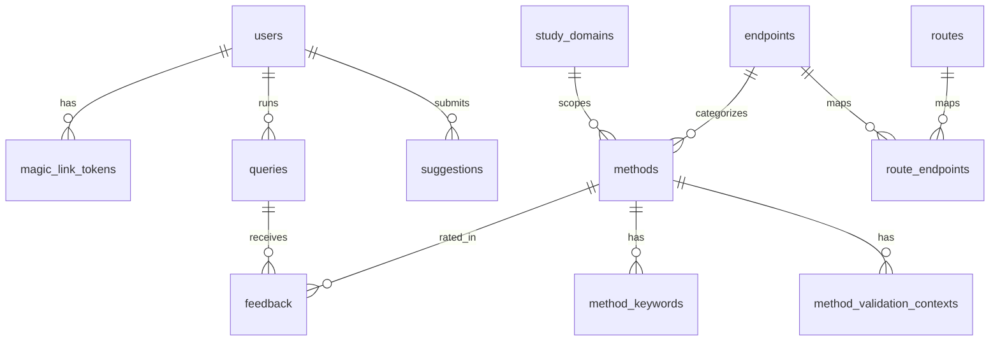

# Database tables

**PostgreSQL only** (not SQLite). Schema for 3R Assist; source of truth: `backend/app/db/migrations/`.

Engine: PostgreSQL via Neon (Vercel Postgres) or a local PostgreSQL instance. Driver: `asyncpg`. Connection: `DATABASE_URL` (`postgresql://` / `postgres://`). See ADR-013 in `docs/decisions.md`.

| Table | Purpose |
| --- | --- |
| [methods](#methods) | Curated 3R alternative methods corpus |
| [method_validation_contexts](#method_validation_contexts) | Per-method validation status by study domain and jurisdiction |
| [method_keywords](#method_keywords) | Synonym dictionary for vocabulary bridging (EN/PT) |
| [endpoints](#endpoints) | Controlled vocabulary for toxicological endpoints |
| [routes](#routes) | Controlled vocabulary for administration routes |
| [study_domains](#study_domains) | Controlled vocabulary for study domains |
| [route_endpoints](#route_endpoints) | Route ↔ endpoint compatibility matrix |
| [users](#users) | Authenticated users (email magic link) |
| [magic_link_tokens](#magic_link_tokens) | Single-use magic-link tokens |
| [queries](#queries) | Protocol analysis / search sessions |
| [feedback](#feedback) | User ratings of recommended methods |
| [suggestions](#suggestions) | User-submitted method suggestions for curation |
| [schema_migrations](#schema_migrations) | Applied migration filenames |

---

## methods

Curated catalogue of alternative methods (replacement, reduction, refinement). Only rows with `active = TRUE` are eligible for retrieval. Validation status and jurisdiction live in `method_validation_contexts`, not on this table.

| Column | Type | Nullable | Default | Description |
| --- | --- | --- | --- | --- |
| `id` | `SERIAL` | NO | auto | Primary key. |
| `slug` | `TEXT` | NO | — | Unique URL-safe identifier (e.g. `oecd-tg439-epiderm`). |
| `name_en` | `TEXT` | NO | — | Method name in English. |
| `name_pt` | `TEXT` | NO | — | Method name in Portuguese. |
| `description_en` | `TEXT` | NO | — | Full description in English. |
| `description_pt` | `TEXT` | NO | — | Full description in Portuguese. |
| `text_for_embedding` | `TEXT` | NO | — | English-only string used at embed time; must match the string that produced `embedding_json`. |
| `replacement_rationale` | `TEXT` | YES | — | Non-null/non-empty ⇒ method qualifies as replacement; value is the auditable rationale (ADR-023). |
| `reduction_rationale` | `TEXT` | YES | — | Non-null/non-empty ⇒ method qualifies as reduction. |
| `refinement_rationale` | `TEXT` | YES | — | Non-null/non-empty ⇒ method qualifies as refinement. |
| `endpoint_category` | `TEXT` | NO | — | Toxicological endpoint code; FK → `endpoints(code)`. |
| `study_domain` | `TEXT` | NO | — | Primary study domain code; FK → `study_domains(code)`. Values: `general`, `pharma`, `cosmetics`, `chemical_safety`. |
| `oecd_tg_ref` | `TEXT` | YES | — | OECD Test Guideline or Guidance Document reference (e.g. `TG 439`, `GD 129`). `NULL` for non-OECD methods. |
| `ncit_id` | `TEXT` | YES | — | NCI Thesaurus concept ID for the endpoint category. |
| `source_db` | `TEXT` | NO | — | Provenance of the curated entry. Values: `OECD_TG`, `ECVAM_DBALM`, `NICEATM`, `FARMACOPEIA_BR`, `TSAR`. |
| `routes_applicable` | `JSONB` | YES | — | Array of applicable route codes (e.g. `["dermal"]`). `NULL` means route-agnostic. |
| `embedding_json` | `JSONB` | YES | — | 384-dim float embedding vector. `NULL` until `embed_methods.py` runs. |
| `active` | `BOOLEAN` | NO | `FALSE` | Whether the method is live in retrieval. Starts `FALSE` pending expert review. |
| `created_at` | `TIMESTAMPTZ` | NO | `NOW()` | Row creation time. |
| `updated_at` | `TIMESTAMPTZ` | NO | `NOW()` | Last update time. |

**Indexes:** `endpoint_category`, `active`.

**3R qualification:** presence of a non-null, non-empty `*_rationale` column means the method qualifies for that R. There is no separate companion flag column. Filter semantics: `replacement_rationale IS NOT NULL` (and likewise for reduction/refinement), not JSONB `@>`.

---

## method_validation_contexts

Validation status and regulatory recognition for a method, scoped by study domain and jurisdiction. One row per `(method_id, study_domain, jurisdiction)`.

| Column | Type | Nullable | Default | Description |
| --- | --- | --- | --- | --- |
| `id` | `SERIAL` | NO | auto | Primary key. |
| `method_id` | `INTEGER` | NO | — | FK → `methods(id)` `ON DELETE CASCADE`. |
| `study_domain` | `TEXT` | NO | — | Study domain for this validation context (`general`, `pharma`, `cosmetics`, `chemical_safety`). |
| `jurisdiction` | `TEXT` | NO | — | Regulatory jurisdiction: `brazil` (CONCEA / ANVISA / MAPA), `eu` (ECHA, EMA, Cosmetics Reg 1223/2009, EFSA), `us` (FDA, EPA, ICCVAM / NICEATM), `oecd` (OECD TG adoption). |
| `validation_status` | `TEXT` | NO | — | Status in that context: `validated`, `accepted`, or `emerging`. |
| `regulatory_body` | `TEXT` | YES | — | Issuing body, e.g. `CONCEA`, `ANVISA`, `ECHA`, `EMA`, `EPA`, `FDA`, `ICCVAM`, `OECD`. |
| `regulatory_ref` | `TEXT` | YES | — | Citation, e.g. `RN 18/2014 Art. 2`, `TG 439`, `Reg 1223/2009`. |
| `regulatory_url` | `TEXT` | YES | — | Link to the regulatory document or guideline. |
| `notes` | `TEXT` | YES | — | Free-text notes (applicability limits, pending verification, etc.). |
| `created_at` | `TIMESTAMPTZ` | NO | `NOW()` | Row creation time. |

**Constraints:** `UNIQUE (method_id, study_domain, jurisdiction)`.

**Indexes:** `method_id`, `jurisdiction`, `(study_domain, jurisdiction)`.

---

## method_keywords

Synonyms and search terms for each method, used for vocabulary bridging between protocol language and method metadata.

| Column | Type | Nullable | Default | Description |
| --- | --- | --- | --- | --- |
| `id` | `SERIAL` | NO | auto | Primary key. |
| `method_id` | `INTEGER` | NO | — | FK → `methods(id)` `ON DELETE CASCADE`. |
| `keyword` | `TEXT` | NO | — | Synonym or search term. |
| `language` | `TEXT` | NO | — | Language of the keyword: `en` or `pt`. |

**Indexes:** `method_id`.

---

## endpoints

Controlled vocabulary for toxicological endpoint categories (`parameter_model.md` §3.1). Referenced by `methods.endpoint_category`.

| Column | Type | Nullable | Default | Description |
| --- | --- | --- | --- | --- |
| `code` | `TEXT` | NO | — | Primary key code (e.g. `skin_irritation`, `acute_toxicity`). |
| `name_en` | `TEXT` | NO | — | Display name in English. |
| `name_pt` | `TEXT` | NO | — | Display name in Portuguese. |
| `description_en` | `TEXT` | YES | — | Longer English description / examples. |
| `description_pt` | `TEXT` | YES | — | Longer Portuguese description / examples. |
| `sort_order` | `INTEGER` | NO | `0` | Display order in UI lists. |
| `active` | `BOOLEAN` | NO | `TRUE` | Whether the value is selectable. |
| `created_at` | `TIMESTAMPTZ` | NO | `NOW()` | Row creation time. |
| `updated_at` | `TIMESTAMPTZ` | NO | `NOW()` | Last update time (trigger-maintained). |

**Seeded codes:** `acute_toxicity`, `skin_irritation`, `skin_corrosion`, `ocular_irritation`, `skin_sensitisation`, `phototoxicity`, `genotoxicity`, `pyrogenicity`, `skin_absorption`.

---

## routes

Controlled vocabulary for chemical administration routes (`parameter_model.md` §3.2).

| Column | Type | Nullable | Default | Description |
| --- | --- | --- | --- | --- |
| `code` | `TEXT` | NO | — | Primary key code (e.g. `oral`, `dermal`). |
| `name_en` | `TEXT` | NO | — | Display name in English. |
| `name_pt` | `TEXT` | NO | — | Display name in Portuguese. |
| `description_en` | `TEXT` | YES | — | Longer English description / synonyms. |
| `description_pt` | `TEXT` | YES | — | Longer Portuguese description / synonyms. |
| `sort_order` | `INTEGER` | NO | `0` | Display order in UI lists. |
| `active` | `BOOLEAN` | NO | `TRUE` | Whether the value is selectable. |
| `created_at` | `TIMESTAMPTZ` | NO | `NOW()` | Row creation time. |
| `updated_at` | `TIMESTAMPTZ` | NO | `NOW()` | Last update time (trigger-maintained). |

**Seeded codes:** `oral`, `intraperitoneal`, `intravenous`, `dermal`, `ocular`, `inhalation`, `in_vitro`, `other`.

---

## study_domains

Controlled vocabulary for study / regulatory domains (`parameter_model.md` §3.3). Referenced by `methods.study_domain` and `method_validation_contexts.study_domain`.

| Column | Type | Nullable | Default | Description |
| --- | --- | --- | --- | --- |
| `code` | `TEXT` | NO | — | Primary key code (e.g. `pharma`, `general`). |
| `name_en` | `TEXT` | NO | — | Display name in English. |
| `name_pt` | `TEXT` | NO | — | Display name in Portuguese. |
| `description_en` | `TEXT` | YES | — | Longer English description. |
| `description_pt` | `TEXT` | YES | — | Longer Portuguese description. |
| `sort_order` | `INTEGER` | NO | `0` | Display order in UI lists. |
| `active` | `BOOLEAN` | NO | `TRUE` | Whether the value is selectable. |
| `created_at` | `TIMESTAMPTZ` | NO | `NOW()` | Row creation time. |
| `updated_at` | `TIMESTAMPTZ` | NO | `NOW()` | Last update time (trigger-maintained). |

**Seeded codes:** `pharma`, `cosmetics`, `chemical_safety`, `general`.

---

## route_endpoints

Compatibility matrix between administration routes and endpoints. Used for route-based soft filtering in retrieval.

| Column | Type | Nullable | Default | Description |
| --- | --- | --- | --- | --- |
| `route_code` | `TEXT` | NO | — | FK → `routes(code)` `ON DELETE CASCADE`. Part of composite PK. |
| `endpoint_code` | `TEXT` | NO | — | FK → `endpoints(code)` `ON DELETE CASCADE`. Part of composite PK. |

**Constraints:** `PRIMARY KEY (route_code, endpoint_code)`.

**Indexes:** `endpoint_code`.

---

## users

Registered users authenticated via email magic link (F08).

| Column | Type | Nullable | Default | Description |
| --- | --- | --- | --- | --- |
| `id` | `SERIAL` | NO | auto | Primary key. |
| `email` | `TEXT` | NO | — | Unique email address. |
| `created_at` | `TIMESTAMPTZ` | NO | `NOW()` | Account creation time. |
| `last_seen_at` | `TIMESTAMPTZ` | NO | `NOW()` | Last successful magic-link validation (set by auth flow). |

---

## magic_link_tokens

Single-use login tokens. Tokens are signed with `itsdangerous`; this table tracks usage to prevent replay within the validity window. The raw token is never stored.

| Column | Type | Nullable | Default | Description |
| --- | --- | --- | --- | --- |
| `id` | `SERIAL` | NO | auto | Primary key. |
| `user_id` | `INTEGER` | NO | — | FK → `users(id)` `ON DELETE CASCADE`. |
| `token_hash` | `TEXT` | NO | — | SHA-256 hash of the raw token. Unique. |
| `expires_at` | `TIMESTAMPTZ` | NO | — | Token expiry time. |
| `used_at` | `TIMESTAMPTZ` | YES | — | Set on first successful verify. `NULL` means unused. |
| `created_at` | `TIMESTAMPTZ` | NO | `NOW()` | Token issuance time. |

**Indexes:** `token_hash`; partial index on `expires_at` where `used_at IS NULL`.

---

## queries

One row per protocol analysis or search session (F09). Stores extraction output and a snapshot of recommendations so history stays stable if methods change later.

| Column | Type | Nullable | Default | Description |
| --- | --- | --- | --- | --- |
| `id` | `SERIAL` | NO | auto | Primary key. |
| `user_id` | `INTEGER` | YES | — | FK → `users(id)` `ON DELETE SET NULL`. `NULL` = anonymous session. |
| `protocol_text` | `TEXT` | NO | — | Raw protocol input text (stored with user consent). |
| `extracted_params` | `JSONB` | YES | — | Extraction result per `parameter_model.md`: `{ endpoint_category, route, study_domain, procedure_text, species, n_animals, regulatory, confidence, raw_text_excerpt }`. |
| `confidence` | `TEXT` | YES | — | Overall extraction confidence: `high`, `medium`, or `low`. |
| `results_snapshot` | `JSONB` | YES | — | Recommendations at query time: `[{ method_id, slug, score }, ...]`. |
| `created_at` | `TIMESTAMPTZ` | NO | `NOW()` | Query time. |

**Indexes:** `user_id`, `created_at DESC`.

---

## feedback

Structured relevance feedback for a recommended method within a query (F11). One rating per method per query.

| Column | Type | Nullable | Default | Description |
| --- | --- | --- | --- | --- |
| `id` | `SERIAL` | NO | auto | Primary key. |
| `query_id` | `INTEGER` | NO | — | FK → `queries(id)` `ON DELETE CASCADE`. |
| `method_id` | `INTEGER` | NO | — | FK → `methods(id)` `ON DELETE CASCADE`. |
| `rating` | `TEXT` | NO | — | Relevance rating: `relevant`, `partial`, or `not_relevant`. |
| `comment` | `TEXT` | YES | — | Optional free-text comment. |
| `created_at` | `TIMESTAMPTZ` | NO | `NOW()` | Feedback submission time. |

**Constraints:** `UNIQUE (query_id, method_id)`.

**Indexes:** `query_id`, `method_id`, `rating`.

---

## suggestions

User-submitted method suggestions queued for manual curation (F12).

| Column | Type | Nullable | Default | Description |
| --- | --- | --- | --- | --- |
| `id` | `SERIAL` | NO | auto | Primary key. |
| `user_id` | `INTEGER` | YES | — | FK → `users(id)` `ON DELETE SET NULL`. Submitter, if authenticated. |
| `name_en` | `TEXT` | NO | — | Suggested method name in English. |
| `name_pt` | `TEXT` | YES | — | Suggested method name in Portuguese. |
| `description` | `TEXT` | YES | — | Free-text description of the method. |
| `source_url` | `TEXT` | YES | — | Link to a source document or publication. |
| `endpoint_hint` | `TEXT` | YES | — | User's best-guess endpoint category; not validated until review. |
| `status` | `TEXT` | NO | `'pending'` | Curation status: `pending`, `reviewed`, `accepted`, or `rejected`. |
| `reviewer_notes` | `TEXT` | YES | — | Notes from the curator. |
| `submitted_at` | `TIMESTAMPTZ` | NO | `NOW()` | Submission time. |
| `reviewed_at` | `TIMESTAMPTZ` | YES | — | Time of review decision. |

**Indexes:** partial index on `status` where `status = 'pending'`.

---

## schema_migrations

Internal bookkeeping for applied SQL migration files. Created by `backend/app/db/connection.py` (`apply_migrations`), not by a numbered migration script.

| Column | Type | Nullable | Default | Description |
| --- | --- | --- | --- | --- |
| `filename` | `TEXT` | NO | — | Primary key. Migration filename (e.g. `001_initial.sql`). |
| `applied_at` | `TIMESTAMPTZ` | NO | `NOW()` | When the migration was applied. |

---

## Entity relationship overview

Migrations that define or alter these tables:

| Migration | Tables |
| --- | --- |
| `001_initial.sql` | `methods`, `method_validation_contexts`, `method_keywords` |
| `002_app_tables.sql` | `users`, `magic_link_tokens`, `queries`, `feedback`, `suggestions` |
| `003_vocabulary_tables.sql` | `endpoints`, `routes`, `study_domains`, `route_endpoints` |
| `004_rename_study_domain.sql` | renames legacy `application_area` / `application_areas` |
| `005_method_validation_contexts.sql` | upgrades legacy schemas to ADR-021/022 |
| `006_route_other.sql` | seeds `routes.other` |
| `007_add_3r_rationale_columns.sql` | adds `replacement_rationale`, `reduction_rationale`, `refinement_rationale` (ADR-023 step 1) |
| `manual/008_drop_category_3r.sql` | drops `category_3r` after rationale gate is clean (ADR-023 step 4; apply via `backfill_3r_rationales.py --apply-drop`) |
